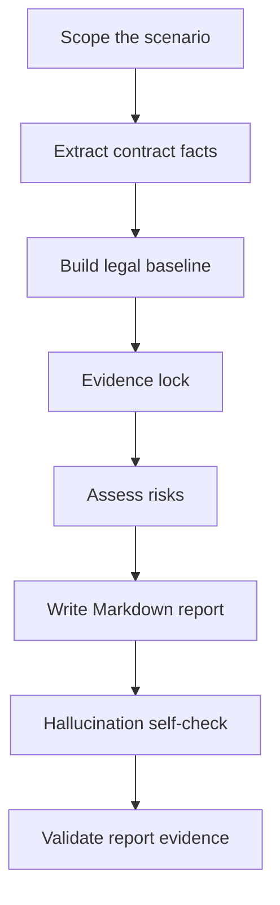

<p align="left">
  <a href="./README.md">English</a>
  |
  <a href="./README.zh.md">中文</a>
</p>

# Global Employment Contract Review

Employer-side HR compliance skill for reviewing global and overseas employment contracts, offer letters, EOR employment documents, expatriate arrangements, and local labor contract templates.

This Skill turns global employment contract review into a reusable workflow: extract contract facts, build a country-specific legal baseline, classify employer-side risks, cite sources, and generate an auditable Markdown review report.

## Why This Skill Was Built

As Chinese companies accelerate their global expansion, business operations increasingly cover more countries and regions, making overseas employment scenarios more complex. Labor laws, immigration rules, payroll practices, social security, individual income tax, termination protection, restrictive covenants, and employer obligations can vary significantly by jurisdiction. Compliant employment is therefore a foundation for stable overseas operations.

Among these compliance matters, employment contract review is the starting point of formal compliant employment. A contract does not only define the employee's basic employment terms. It also affects payroll execution, leave management, performance management, employee relations, termination handling, dispute response, and evidence retention. As overseas hiring grows, the need to review employment contracts across different countries and regions continues to increase.

In practice, no single HR professional or lawyer can fully master the labor laws, immigration rules, and employment practices of every country and region. At the same time, employment contract review and employee relations management share common patterns: identifying the legal employer, work location, governing law, compensation and benefits, working time and leave, termination arrangements, employee entitlements, employer protections, evidence retention, and items requiring confirmation.

This Skill is based on overseas HR expert AlexD's practical experience in multinational HR management and multi-jurisdiction employment contract review. With AI, that experience is distilled into a standardized workflow covering review logic, risk classification, source verification, and report structure. To reduce AI hallucination and improve output quality and auditability, the Skill uses official-source priority, Evidence lock, mandatory fallback wording, signing-before-confirmation items, and a report evidence validation script.

## What It Reviews

The Skill reviews global and overseas employment-related documents that may create employment obligations for the company, including:

- local employment agreements;
- offer letters containing employment terms;
- EOR employment templates;
- expatriate employment documents;
- fixed-term and indefinite employment contracts;
- country-specific labor contract templates;
- annexes or side documents that affect compensation, leave, termination, bonus, commission, confidentiality, IP, restrictive covenants, or workplace policies;
- contracts where Legal, HR, Payroll, EOR, Tax/Finance, visa vendors, local counsel, or business owners may need to confirm signing risks.

For each document, the Skill checks:

- whether any clause appears to conflict with mandatory local employment rules;
- whether statutory mandatory contract content is missing or needs confirmation;
- whether the contract grants employee rights or company commitments above statutory minimums;
- whether the wording creates employer-unfavorable cost, management, evidence, enforceability, or termination risk;
- which issues require Legal, local counsel, Payroll, EOR, Tax/Finance, visa vendor, or business owner confirmation before signing.

## Review Position

The Skill uses an **employer-side HR compliance perspective** and treats the company as the review client.

It does not simply ask whether the employee receives enough protection. It asks whether the employer can sign, operate, prove, modify, and terminate under the contract without creating unnecessary risk.

The review position is:

- compliance first;
- cost controlled;
- operationally executable;
- evidence-ready;
- legally cautious;
- no final legal sign-off.

It does **not** provide final legal sign-off. High-risk or uncertain points are converted into HR-actionable recommendations and confirmation items.

## How It Works



### Workflow

1. **Scope the scenario**  
   Identify country/region, employee type, employment model, legal employer, work location, governing law, payroll location, visa/work authorization, and document type.

2. **Extract contract facts**  
   Extract clauses before judging them. Use `scripts/extract_contract_text.py` when reviewing PDF, DOCX, TXT, or Markdown files.

3. **Build the legal baseline**  
   Use official sources first. Do not invent laws, statutory thresholds, official names, salary benchmarks, or benefit rules.

4. **Evidence lock**  
   Bind every planned finding to:
   - contract evidence: page, section, short original excerpt;
   - rule/source evidence: official source label, contract text, internal file, or required fallback warning.

5. **Assess risks**  
   Classify each substantive issue into one of four handling categories.

6. **Write the report**  
   Use the report template and fixed clause review fields.

7. **Self-check and validate**  
   Run the evidence hygiene validator when a local Markdown report is generated.

## Risk Levels

| Level | Name | Handling Action |
|---|---|---|
| 🔴 | 重大合规风险 | 必须修改 |
| 🟠 | 重要雇主风险 | 建议确认或调整 |
| 🟡 | 一般条款风险 | 建议完善 |
| 🟢 | 文件完善事项 / 雇主保护补充 | 建议补充 |

This distinction matters. A clause can be lawful but still commercially or operationally unfavorable to the employer. Such issues should not always be labelled as "must revise"; they may need confirmation, narrowing, or business approval.

## Report Structure

The generated Markdown report follows this structure:

```text
一、总体结论
二、合同基础信息与审查假设
三、风险总览
四、🔴 必须修改：明显违法或法定必备缺失条款
五、🟠 建议确认或调整：高于法定权益 / 额外承诺条款
六、🟡 建议完善：无明显违法但边界不清条款
七、🟢 建议补充：雇主保护条款
八、最终处理清单
九、签署前待确认事项
十、来源清单
附录：可以保留 / 暂不修改条款
```

Each finding in Sections 4-7 uses the same six fields:

```markdown
**条款位置：**
**原文内容：**
**问题判断：**
**雇主影响：**
**修改建议：**
**依据：**
```

This lets HR, Legal, Payroll, EOR, and business owners quickly locate the original wording, understand the impact, assign actions, and retain evidence.

## Source Discipline

Every risk finding must have source support.

Source priority:

1. Official legislation, labor code, employment act, gazette, consolidated statute, or government legal database.
2. Official labor ministry, immigration authority, tax authority, social security authority, regulator, court, or labor tribunal guidance.
3. Official government FAQ, employer guide, wage order, leave entitlement page, or visa/work permit page.
4. EOR, vendor, or local counsel material as secondary support.
5. Reputable law firm or accounting firm updates when official sources are unavailable or too general.
6. Model knowledge only as fallback.

If no official source is found, the report must include:

```text
⚠️ 未检索到官方来源，以下基于模型知识库，需人工核实。
```

## Anti-Hallucination Controls

This Skill includes explicit safeguards to reduce unsupported legal conclusions:

- no invented laws, article numbers, statutory days, rates, amounts, visa rules, or official institution names;
- no contract facts unless supported by the contract, annexes, offer letter, employee baseline information, or user-provided context;
- every finding must bind contract evidence and source evidence;
- cited sources must support the exact judgment, not merely the general topic;
- uncertain issues are moved to `签署前待确认事项`;
- final reports can be checked by `scripts/validate_report_evidence.py`.

The validator checks required fields, source labels, unresolved placeholders, over-certain wording, and required sections.

## Installation

### Prerequisites

- Claude Code, Codex, or another Agent Skills-compatible assistant.
- Git installed for clone-based installation.
- Supported system: Windows, macOS, or Linux.

### Method 1: Clone to skills directory

For Claude Code:

```bash
# Linux / macOS
git clone https://github.com/AlexDou-Y/global-employment-contract-review.git \
  ~/.claude/skills/global-employment-contract-review
```

```powershell
# Windows PowerShell
git clone https://github.com/AlexDou-Y/global-employment-contract-review.git `
  "$HOME\.claude\skills\global-employment-contract-review"
```

For Codex:

```bash
# Linux / macOS
git clone https://github.com/AlexDou-Y/global-employment-contract-review.git \
  ~/.codex/skills/global-employment-contract-review
```

```powershell
# Windows PowerShell
git clone https://github.com/AlexDou-Y/global-employment-contract-review.git `
  "$HOME\.codex\skills\global-employment-contract-review"
```

### Method 2: Manual download

1. Download this repository as a ZIP file.
2. Extract the ZIP file.
3. Copy the entire `global-employment-contract-review/` directory to your skills directory:

| Assistant | Linux / macOS | Windows |
|---|---|---|
| Claude Code | `~/.claude/skills/` | `%USERPROFILE%\.claude\skills\` |
| Codex | `~/.codex/skills/` | `%USERPROFILE%\.codex\skills\` |

### Verify installation

Restart or reload your assistant, then check the skills list:

- Claude Code: type `/skills` and confirm that `global-employment-contract-review` appears.
- Codex: start a new session and confirm the Skill is available in the skills list.

## How To Use

Attach or provide the contract file, then explicitly call the Skill in your prompt:

```text
使用 global-employment-contract-review，按雇主方 HR 合规审查视角，审核这个澳洲劳动合同。请输出 Markdown 报告，所有风险提示需要标注来源；如无法找到官方来源，请使用降级提示并列入签署前待确认事项。
```

For best results, provide:

- country / region;
- employee type and work location;
- legal employer and payroll entity;
- contract file or extracted contract text;
- any known Modern Award, collective agreement, EOR, payroll, tax, visa, or local counsel context.

## Tools

### Extract contract text

```powershell
python scripts\extract_contract_text.py "path\to\contract.pdf" -o "path\to\contract.txt"
```

Supported input formats:

- `.pdf`
- `.docx`
- `.txt`
- `.md`

### Validate report evidence

```powershell
python scripts\validate_report_evidence.py "path\to\review-report.md"
```

The validator checks:

- required fields in each finding;
- missing source labels;
- source labels used but not listed;
- unresolved placeholders;
- over-certain wording such as `完全合规`, `无风险`, `一定合法`, `保证合规`;
- required sections such as `签署前待确认事项` and `来源清单`.

## Directory Structure

```text
global-employment-contract-review/
├─ SKILL.md
├─ README.md
├─ README.zh.md
├─ agents/
│  └─ openai.yaml
├─ docs/
│  ├─ introducing-global-employment-contract-review-skill.en.md
│  ├─ introducing-global-employment-contract-review-skill.zh.md
│  └─ introducing-global-employment-contract-review-skill.zh-en.md
├─ references/
│  ├─ anti-hallucination-rules.md
│  ├─ country-rule-template.md
│  ├─ output-requirements.md
│  ├─ review-framework.md
│  ├─ risk-taxonomy.md
│  └─ source-verification-rules.md
├─ scripts/
│  ├─ extract_contract_text.py
│  └─ validate_report_evidence.py
└─ templates/
   ├─ contract-review-report.md
   ├─ country-rule-card.md
   └─ issue-list-table.md
```

## Example Prompt

```text
使用 global-employment-contract-review，按雇主方 HR 合规审查视角，审核这个澳洲劳动合同。请输出 Markdown 报告，所有风险提示需要标注来源；如无法找到官方来源，请使用降级提示并列入签署前待确认事项。
```

## Validation

Recommended checks after modifying this Skill:

```powershell
$env:PYTHONUTF8='1'
python "<path-to-skill-creator>\scripts\quick_validate.py" "."
python ".\scripts\validate_report_evidence.py" "path\to\review-report.md"
```

Expected outputs:

```text
Skill is valid!
Evidence validation passed.
```

## Limitations

- This Skill supports HR compliance review and contract risk triage. It does not replace final legal advice.
- Official source availability varies by country and topic.
- Restrictive covenant, termination, tax, social security, immigration, and EOR responsibility issues often require local counsel, vendor, Payroll, Tax/Finance, or Legal confirmation.
- If facts are missing, the report should state assumptions and list signing-before-confirmation items.
