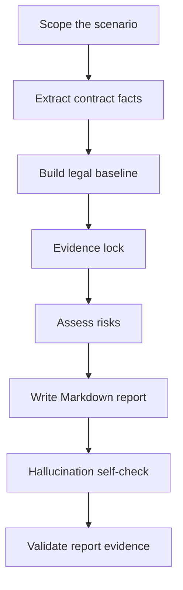

<p align="left">
  <a href="./README.md">English</a>
  |
  <a href="./README.zh.md">中文</a>
</p>

# Global Employment Contract Review

Employer-side HR compliance skill for reviewing overseas employment contracts and Offer Letters.

This Skill turns global employment contract review into a reusable workflow: extract contract facts, build a country-specific legal baseline, classify employer-side risks, cite sources, and generate an auditable Markdown review report.

## Update Highlights

- Expanded the contract review from six to seven mandatory review judgments by adding a “local mandatory mechanisms and China comparison” dimension for rules that affect workforce budget, Payroll configuration, HR processes, or employment operations.
- Added dual official-source requirements for the local rule and the China national-law comparison, plus a mandatory summary row and compact table. Compliant local mechanisms must still be shown without creating false risk findings.
- Extended the report validator to check the local-difference summary, table, contract statuses, and evidence labels.
- Added political, sovereignty, and country/region terminology review for overseas employment documents. The review is not limited to Taiwan, Hong Kong, and Macau; it also covers globally common territorial disputes and sensitive jurisdictional wording, including disputed territories, government names, governing law, jurisdiction, public authorities, and legal-system references.
- Added the `⚑` marker for political / sovereignty / territory-sensitive findings. `⚑` is a review dimension marker, not a severity level; it should be paired with `🔴`, `🟠`, `🟡`, or `🟢` when priority needs to be shown.
- Updated the `🟠` section from "above-statutory entitlements / extra commitments" to "important employer risks / signing-before-confirmation items", so political and governance-sensitive issues are not incorrectly classified as employee-benefit issues.

## Version Update Log

| Date | Update |
|---|---|
| 2026.07.24 | Added the seventh mandatory review judgment for local mandatory mechanisms and China comparison, the fixed summary table, and evidence-validation hard gates |
| 2026.06.09 | Added political, sovereignty, and country/region terminology review |
| 2026.06.04 | Initial release |

## Update Notes (2026.07.24)

This iteration arose from practical reviews of Mexican and Egyptian employment contracts. Some mandatory local mechanisms have no equivalent uniform mechanism in the verified China national-level employment rules, yet directly increase employment cost or change HR and Payroll operations. The Skill now identifies these differences proactively and translates them into budget and implementation actions.

Key changes:

1. **Expanded from six to seven mandatory review judgments**
   This iteration adds the seventh judgment, “local mandatory mechanisms and China comparison.” The Skill now requires all seven:

   - `是否可以作为当地雇佣合同基础版本`;
   - `是否存在明显违法或低于法定底线的条款`;
   - `法定必备条款是否全面`;
   - `是否存在需签署前修改的雇主方风险`;
   - `是否存在高于法定权益 / 额外承诺`;
   - `是否存在 ⚑ 政治/主权/地域称谓敏感表述`;
   - `是否存在需 HR 特别关注的当地法定差异`.

   The seventh judgment covers statutory salary adjustments, pay frequency, mandatory bonuses or allowances, special leave benefits, working-time costs, social security, and termination costs.

2. **Added dual official-source requirements**
   The local rule must be supported by a local official source, and the China comparison must use an official China national-level source. If the review cannot prove that China has no comparable rule, it uses qualified wording equivalent to “no equivalent uniform mandatory mechanism was identified in the verified China national-level rules.” If either side is not verified, the contract status must be `待确认`.

3. **Added a mandatory local-difference summary and table**
   Every report must include the exact overall-conclusion row `是否存在需 HR 特别关注的当地法定差异` and the following fixed fields:

   ```text
   事项 | 当地规则及中国差异 | 合同状态 | 雇主影响 | HR 动作 | 依据
   ```

   Only these contract statuses are allowed: `与法律冲突`, `缺少法定必备内容`, `法律直接适用但合同未明确`, `合同已覆盖`, and `待确认`.

4. **Kept the existing risk taxonomy and prevented false risks**
   Contract conflicts remain classified under the existing `🔴`, `🟠`, `🟡`, and `🟢` taxonomy. Compliant mechanisms such as Aguinaldo or Prima Vacacional appear only in the local-difference table with their budget and Payroll impact; they are not repeated as contract risks.

5. **Strengthened cost and operational outputs**
   Every difference must explain its effect on budget, Payroll, HR process, or workforce arrangements. If verified rules and contract facts do not support a precise amount, the report gives only the cost item, formula, and responsible calculator.

6. **Added structural validation hard gates**
   `scripts/validate_report_evidence.py` now checks the fixed summary row, local-difference table, contract statuses, and evidence labels. The Mexican test case confirms that a wage-payment interval of no more than 15 days does not mean a mandatory 14-day biweekly cycle. Mexican and Egyptian scenarios were used for behavioral retesting, but this iteration does not hard-code either country as a country rule card.

## Why This Skill Was Built

As Chinese companies accelerate their global expansion, business operations increasingly cover more countries and regions, making overseas employment scenarios more complex. Labor laws, immigration rules, payroll practices, social security, individual income tax, termination protection, restrictive covenants, and employer obligations can vary significantly by jurisdiction. Compliant employment is therefore a foundation for stable overseas operations.

Among these compliance matters, employment contract review is the starting point of formal compliant employment. A contract does not only define the employee's basic employment terms. It also affects payroll execution, leave management, performance management, employee relations, termination handling, dispute response, and evidence retention. As overseas hiring grows, the need to review employment contracts across different countries and regions continues to increase.

In practice, no single HR professional or lawyer can fully master the labor laws, immigration rules, and employment practices of every country and region. At the same time, employment contract review and employee relations management share common patterns: identifying the legal employer, work location, governing law, compensation and benefits, working time and leave, termination arrangements, employee entitlements, employer protections, evidence retention, and items requiring confirmation.

This Skill is based on an overseas HR practitioner's practical experience reviewing employment contracts across multiple countries and regions. With AI, that experience is distilled into a standardized workflow covering review logic, risk classification, source verification, and report structure. To reduce AI hallucination and improve output quality and auditability, the Skill uses official-source priority, Evidence lock, mandatory fallback wording, signing-before-confirmation items, and a report evidence validation script.

## What It Reviews

The Skill reviews overseas employment-related documents that may create employment obligations for the company. The document scope is limited to:

- overseas employment contracts;
- Offer Letters containing employment terms;
- fixed-term and indefinite employment contracts;
- annexes or side documents attached to an employment contract or Offer Letter that directly affect compensation, leave, termination, bonus, commission, confidentiality, IP, restrictive covenants, or workplace policies.

For each document, the Skill completes all seven mandatory review judgments:

1. `是否可以作为当地雇佣合同基础版本`;
2. `是否存在明显违法或低于法定底线的条款`;
3. `法定必备条款是否全面`;
4. `是否存在需签署前修改的雇主方风险`;
5. `是否存在高于法定权益 / 额外承诺`;
6. `是否存在 ⚑ 政治/主权/地域称谓敏感表述`;
7. `是否存在需 HR 特别关注的当地法定差异`.
## Review Position

The Skill uses an **employer-side HR compliance perspective** and treats the company as the review client.

It does not simply ask whether the employee receives enough protection. It asks whether the employer can sign, operate, prove, modify, and terminate under the contract without creating unnecessary risk.

The review position is:

- compliance first;
- cost controlled;
- operationally executable;
- evidence-ready;
- legally cautious;
- no final legal sign-off.

It does **not** provide final legal sign-off. High-risk or uncertain points are converted into HR-actionable recommendations and confirmation items.

## How It Works



### Workflow

1. **Scope the scenario**
   Identify country/region, employee type, employment model, legal employer, work location, governing law, payroll location, visa/work authorization, and document type.

2. **Extract contract facts**
   Extract clauses before judging them. Use `scripts/extract_contract_text.py` when reviewing PDF, DOCX, TXT, or Markdown files.

3. **Build the legal baseline**
   Use official sources first. Do not invent laws, statutory thresholds, official names, salary benchmarks, or benefit rules.

4. **Evidence lock**
   Bind every planned finding to:
   - contract evidence: page, section, short original excerpt;
   - rule/source evidence: official source label, contract text, internal file, or required fallback warning.

5. **Assess risks**
   Complete seven mandatory review judgments, with the seventh covering local mandatory mechanisms and China comparison. Substantive contract issues still use one of four handling categories; compliant local mechanisms appear only in the fixed summary table.

6. **Write the report**
   Use the report template and fixed clause review fields.

7. **Self-check and validate**  
   Run the evidence hygiene validator when a local Markdown report is generated.

## Risk Levels

| Level | Name | Handling Action |
|---|---|---|
| 🔴 | 重大合规风险 | 必须修改 |
| 🟠 | 重要雇主风险 | 建议确认或调整 |
| 🟡 | 一般条款风险 | 建议完善 |
| 🟢 | 文件完善事项 / 雇主保护补充 | 建议补充 |

This distinction matters. A clause can be lawful but still commercially or operationally unfavorable to the employer. Such issues should not always be labelled as "must revise"; they may need confirmation, narrowing, or business approval.

The seventh judgment, “local mandatory mechanisms and China comparison,” is mandatory but is not a new risk level. When the contract already covers the local mechanism, report its budget and operational impact without assigning a risk color merely because it differs from China.

## Report Structure

The generated Markdown report follows this structure:

```text
一、总体结论
二、合同基础信息与审查假设
三、风险总览
四、🔴 必须修改：明显违法或法定必备缺失条款
五、🟠 建议确认或调整：重要雇主风险 / 签前确认事项
六、🟡 建议完善：无明显违法但边界不清条款
七、🟢 建议补充：雇主保护条款
八、最终处理清单
九、签署前待确认事项
十、来源清单
附录：可以保留 / 暂不修改条款
```

The `总体结论` section must contain `是否存在需 HR 特别关注的当地法定差异`, immediately followed by the `### 当地特殊法定机制及中外差异提示` table. If a table item is also a substantive contract risk, cross-reference the numbered finding instead of repeating the full analysis.

Each finding in Sections 4-7 uses the same six fields:

```markdown
**条款位置：**
**原文内容：**
**问题判断：**
**雇主影响：**
**修改建议：**
**依据：**
```

This lets HR, Legal, Payroll, EOR, and business owners quickly locate the original wording, understand the impact, assign actions, and retain evidence.

## Source Discipline

Every risk finding must have source support.

Source priority:

1. Official legislation, labor code, employment act, gazette, consolidated statute, or government legal database.
2. Official labor ministry, immigration authority, tax authority, social security authority, regulator, court, or labor tribunal guidance.
3. Official government FAQ, employer guide, wage order, leave entitlement page, or visa/work permit page.
4. EOR, vendor, or local counsel material as secondary support.
5. Reputable law firm or accounting firm updates when official sources are unavailable or too general.
6. Model knowledge only as fallback.

If no official source is found, the report must include:

```text
⚠️ 未检索到官方来源，以下基于模型知识库，需人工核实。
```

## Anti-Hallucination Controls

This Skill includes explicit safeguards to reduce unsupported legal conclusions:

- no invented laws, article numbers, statutory days, rates, amounts, visa rules, or official institution names;
- no contract facts unless supported by the contract, annexes, offer letter, employee baseline information, or user-provided context;
- every finding must bind contract evidence and source evidence;
- cited sources must support the exact judgment, not merely the general topic;
- uncertain issues are moved to `签署前待确认事项`;
- final reports can be checked by `scripts/validate_report_evidence.py`.

The validator checks required fields, source labels, unresolved placeholders, over-certain wording, and required sections.

For the local-difference dimension, it also checks the fixed summary row, compact table, allowed contract statuses, and `[S#]` evidence labels. A confirmed local-versus-China comparison must cite both the local and China legal baselines.

## Installation

### Prerequisites

- Claude Code, Codex, or another Agent Skills-compatible assistant.
- Git installed for clone-based installation.
- Supported system: Windows, macOS, or Linux.

### Method 1: Clone to skills directory

For Claude Code:

```bash
# Linux / macOS
git clone https://github.com/AlexDou-Y/global-employment-contract-review.git \
  ~/.claude/skills/global-employment-contract-review
```

```powershell
# Windows PowerShell
git clone https://github.com/AlexDou-Y/global-employment-contract-review.git `
  "$HOME\.claude\skills\global-employment-contract-review"
```

For Codex:

```bash
# Linux / macOS
git clone https://github.com/AlexDou-Y/global-employment-contract-review.git \
  ~/.codex/skills/global-employment-contract-review
```

```powershell
# Windows PowerShell
git clone https://github.com/AlexDou-Y/global-employment-contract-review.git `
  "$HOME\.codex\skills\global-employment-contract-review"
```

### Method 2: Manual download

1. Download this repository as a ZIP file.
2. Extract the ZIP file.
3. Copy the entire `global-employment-contract-review/` directory to your skills directory:

| Assistant | Linux / macOS | Windows |
|---|---|---|
| Claude Code | `~/.claude/skills/` | `%USERPROFILE%\.claude\skills\` |
| Codex | `~/.codex/skills/` | `%USERPROFILE%\.codex\skills\` |

### Verify installation

Restart or reload your assistant, then check the skills list:

- Claude Code: type `/skills` and confirm that `global-employment-contract-review` appears.
- Codex: start a new session and confirm the Skill is available in the skills list.

## How To Use

Attach or provide the contract file, then explicitly call the Skill in your prompt:

```text
使用 global-employment-contract-review，按雇主方 HR 合规审查视角，审核这个澳洲劳动合同。请输出 Markdown 报告，所有风险提示需要标注来源；如无法找到官方来源，请使用降级提示并列入签署前待确认事项。
```

For best results, provide:

- country / region;
- employee type and work location;
- legal employer and payroll entity;
- contract file or extracted contract text;
- any known Modern Award, collective agreement, EOR, payroll, tax, visa, or local counsel context.

## Tools

### Extract contract text

```powershell
python scripts\extract_contract_text.py "path\to\contract.pdf" -o "path\to\contract.txt"
```

Supported input formats:

- `.pdf`
- `.docx`
- `.txt`
- `.md`

### Validate report evidence

```powershell
python scripts\validate_report_evidence.py "path\to\review-report.md"
```

The validator checks:

- required fields in each finding;
- missing source labels;
- source labels used but not listed;
- unresolved placeholders;
- over-certain wording such as `完全合规`, `无风险`, `一定合法`, `保证合规`;
- required sections such as `签署前待确认事项` and `来源清单`.

## Directory Structure

```text
global-employment-contract-review/
├─ SKILL.md
├─ README.md
├─ README.zh.md
├─ agents/
│  └─ openai.yaml
├─ docs/
│  ├─ introducing-global-employment-contract-review-skill.en.md
│  ├─ introducing-global-employment-contract-review-skill.zh.md
│  └─ introducing-global-employment-contract-review-skill.zh-en.md
├─ references/
│  ├─ anti-hallucination-rules.md
│  ├─ country-rule-template.md
│  ├─ output-requirements.md
│  ├─ review-framework.md
│  ├─ risk-taxonomy.md
│  └─ source-verification-rules.md
├─ scripts/
│  ├─ extract_contract_text.py
│  └─ validate_report_evidence.py
├─ tests/
│  ├─ test_local_difference_source_validation.py
│  ├─ test_readme_local_difference_update.py
│  ├─ test_seven_review_judgments.py
│  └─ test_validate_report_evidence.py
└─ templates/
   ├─ contract-review-report.md
   ├─ country-rule-card.md
   └─ issue-list-table.md
```

## Example Prompt

```text
使用 global-employment-contract-review，按雇主方 HR 合规审查视角，审核这个澳洲劳动合同。请输出 Markdown 报告，所有风险提示需要标注来源；如无法找到官方来源，请使用降级提示并列入签署前待确认事项。
```

## Validation

Recommended checks after modifying this Skill:

```powershell
$env:PYTHONUTF8='1'
python "<path-to-skill-creator>\scripts\quick_validate.py" "."
python ".\scripts\validate_report_evidence.py" "path\to\review-report.md"
```

Expected outputs:

```text
Skill is valid!
Evidence validation passed.
```

## Limitations

- This Skill supports HR compliance review and contract risk triage. It does not replace final legal advice.
- Official source availability varies by country and topic.
- Restrictive covenant, termination, tax, social security, immigration, and EOR responsibility issues often require local counsel, vendor, Payroll, Tax/Finance, or Legal confirmation.
- If facts are missing, the report should state assumptions and list signing-before-confirmation items.

## Acknowledgements

This Skill is continuously improved based on Alex Dou's HR management experience in Chinese and international companies, as well as practical work reviewing and handling employment contracts and employee relations matters across China, Japan, Korea, Southeast Asia, the Middle East, Europe, and other countries and regions. These cross-regional employment scenarios, case reviews, and accumulated methods provide the foundation for the Skill's review framework, risk classification, source verification, and output structure.
