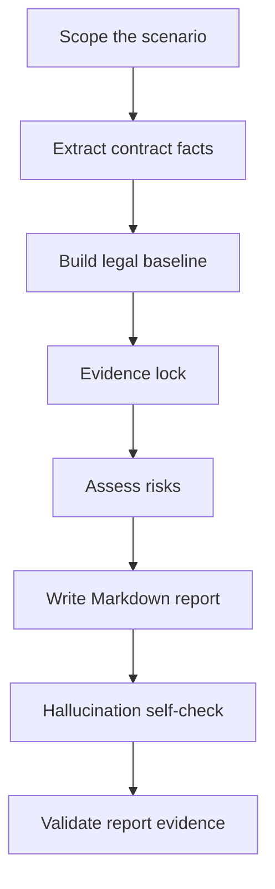

# Review Overseas Employment Contracts

Employer-side HR compliance skill for reviewing overseas employment contracts, offer letters, EOR employment documents, expatriate arrangements, and local labor contract templates.

This Skill turns overseas employment contract review into a reusable workflow: extract contract facts, build a country-specific legal baseline, classify employer-side risks, cite sources, and generate an auditable Markdown review report.

## What It Does

- Reviews overseas employment contracts from the **employer-side HR compliance** perspective.
- Checks whether the document appears legally usable, operationally executable, cost-controlled, and not unnecessarily unfavorable to the employer.
- Identifies whether the contract:
  - may violate local mandatory employment rules;
  - misses mandatory employment contract content;
  - grants employee rights above statutory minimums;
  - creates employer-unfavorable cost, flexibility, evidence, enforcement, or termination risk.
- Produces a structured Markdown report with risk levels, action owners, signing-before-confirmation items, and source citations.

## When To Use

Use this Skill when reviewing:

- local employment agreements;
- offer letters with employment terms;
- EOR employment templates;
- expatriate employment documents;
- fixed-term or indefinite employment contracts;
- country-specific labor contract templates;
- contracts where Legal, HR, Payroll, EOR, Tax, visa, or local counsel input may be needed.

## Review Position

The Skill treats the company as the review client.

It prioritizes:

- employer compliance exposure;
- mandatory local law and statutory minimums;
- payroll, tax, social security, visa, and work authorization implications;
- clauses that increase cost or reduce employer flexibility;
- evidence, enforceability, termination, restrictive covenant, policy, and record-retention risks.

It does **not** provide final legal sign-off. High-risk or uncertain points are converted into HR-actionable recommendations and confirmation items.

## How It Works



### Workflow

1. **Scope the scenario**  
   Identify country/region, employee type, employment model, legal employer, work location, governing law, payroll location, visa/work authorization, and document type.

2. **Extract contract facts**  
   Extract clauses before judging them. Use `scripts/extract_contract_text.py` when reviewing PDF, DOCX, TXT, or Markdown files.

3. **Build the legal baseline**  
   Use official sources first. Do not invent laws, statutory thresholds, official names, salary benchmarks, or benefit rules.

4. **Evidence lock**  
   Bind every planned finding to:
   - contract evidence: page, section, short original excerpt;
   - rule/source evidence: official source label, contract text, internal file, or required fallback warning.

5. **Assess risks**  
   Classify each substantive issue into one of four handling categories.

6. **Write the report**  
   Use the report template and fixed clause review fields.

7. **Self-check and validate**  
   Run the evidence hygiene validator when a local Markdown report is generated.

## Risk Levels

| Level | Name | Handling Action |
|---|---|---|
| 🔴 | 重大合规风险 | 必须修改 |
| 🟠 | 重要雇主风险 | 建议确认或调整 |
| 🟡 | 一般条款风险 | 建议完善 |
| 🟢 | 文件完善事项 / 雇主保护补充 | 建议补充 |

## Report Structure

The generated Markdown report follows this structure:

```text
一、总体结论
二、合同基础信息与审查假设
三、风险总览
四、🔴 必须修改：明显违法或法定必备缺失条款
五、🟠 建议确认或调整：高于法定权益 / 额外承诺条款
六、🟡 建议完善：无明显违法但边界不清条款
七、🟢 建议补充：雇主保护条款
八、最终处理清单
九、签署前待确认事项
十、来源清单
附录：可以保留 / 暂不修改条款
```

Each finding in Sections 4-7 uses the same six fields:

```markdown
**条款位置：**
**原文内容：**
**问题判断：**
**雇主影响：**
**修改建议：**
**依据：**
```

## Source Discipline

Every risk finding must have source support.

Source priority:

1. Official legislation, labor code, employment act, gazette, consolidated statute, or government legal database.
2. Official labor ministry, immigration authority, tax authority, social security authority, regulator, court, or labor tribunal guidance.
3. Official government FAQ, employer guide, wage order, leave entitlement page, or visa/work permit page.
4. EOR, vendor, or local counsel material as secondary support.
5. Reputable law firm or accounting firm updates when official sources are unavailable or too general.
6. Model knowledge only as fallback.

If no official source is found, the report must include:

```text
⚠️ 未检索到官方来源，以下基于模型知识库，需人工核实。
```

## Anti-Hallucination Controls

This Skill includes explicit safeguards to reduce unsupported legal conclusions:

- no invented laws, article numbers, statutory days, rates, amounts, visa rules, or official institution names;
- no contract facts unless supported by the contract, annexes, offer letter, employee baseline information, or user-provided context;
- every finding must bind contract evidence and source evidence;
- cited sources must support the exact judgment, not merely the general topic;
- uncertain issues are moved to `签署前待确认事项`;
- final reports can be checked by `scripts/validate_report_evidence.py`.

## Tools

### Extract contract text

```powershell
python scripts\extract_contract_text.py "path\to\contract.pdf" -o "path\to\contract.txt"
```

Supported input formats:

- `.pdf`
- `.docx`
- `.txt`
- `.md`

### Validate report evidence

```powershell
python scripts\validate_report_evidence.py "path\to\review-report.md"
```

The validator checks:

- required fields in each finding;
- missing source labels;
- source labels used but not listed;
- unresolved placeholders;
- over-certain wording such as `完全合规`, `无风险`, `一定合法`, `保证合规`;
- required sections such as `签署前待确认事项` and `来源清单`.

## Directory Structure

```text
review-overseas-employment-contracts/
├─ SKILL.md
├─ README.md
├─ agents/
│  └─ openai.yaml
├─ docs/
│  ├─ introducing-review-overseas-employment-contracts-skill.en.md
│  ├─ introducing-review-overseas-employment-contracts-skill.zh.md
│  └─ introducing-review-overseas-employment-contracts-skill.zh-en.md
├─ references/
│  ├─ anti-hallucination-rules.md
│  ├─ country-rule-template.md
│  ├─ output-requirements.md
│  ├─ review-framework.md
│  ├─ risk-taxonomy.md
│  └─ source-verification-rules.md
├─ scripts/
│  ├─ extract_contract_text.py
│  └─ validate_report_evidence.py
└─ templates/
   ├─ contract-review-report.md
   ├─ country-rule-card.md
   └─ issue-list-table.md
```

## Example Prompt

```text
使用 review-overseas-employment-contracts，按雇主方 HR 合规审查视角，审核这个澳洲劳动合同。请输出 Markdown 报告，所有风险提示需要标注来源；如无法找到官方来源，请使用降级提示并列入签署前待确认事项。
```

## Validation

Recommended checks after modifying this Skill:

```powershell
$env:PYTHONUTF8='1'
python "<path-to-skill-creator>\scripts\quick_validate.py" "."
python ".\scripts\validate_report_evidence.py" "path\to\review-report.md"
```

Expected outputs:

```text
Skill is valid!
Evidence validation passed.
```

## Limitations

- This Skill supports HR compliance review and contract risk triage. It does not replace final legal advice.
- Official source availability varies by country and topic.
- Restrictive covenant, termination, tax, social security, immigration, and EOR responsibility issues often require local counsel, vendor, Payroll, Tax/Finance, or Legal confirmation.
- If facts are missing, the report should state assumptions and list signing-before-confirmation items.
