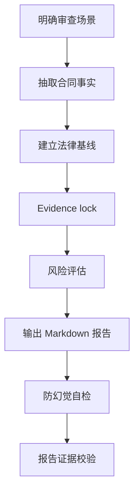

<p align="left">
  <a href="./README.md">English</a>
  |
  <a href="./README.zh.md">中文</a>
</p>

# 海外劳动合同雇主方审核 Skill

用于审核海外劳动合同、offer letter、EOR 雇佣文件、外派文件和本地劳动合同模板的雇主方 HR 合规审查 Skill。

这个 Skill 将海外劳动合同审核沉淀为一套可复用工作流：抽取合同事实、建立国家/地区法律基线、识别雇主方风险、标注依据来源，并生成可审计的 Markdown 审核报告。

## 它能做什么

- 从 **雇主方 HR 合规审查** 视角审核海外劳动合同。
- 判断合同是否具备法律可用性、操作可执行性、成本可控性，以及是否存在不必要的雇主不利条款。
- 识别合同是否：
  - 可能违反当地强制性劳动规则；
  - 缺少劳动合同法定必备内容；
  - 授予员工高于法定最低标准的权益；
  - 形成对雇主不利的成本、灵活性、证据、执行或解除风险。
- 输出结构化 Markdown 报告，包括风险等级、处理责任方、签署前待确认事项和来源清单。

## 适用场景

适用于审核：

- 本地劳动合同；
- 包含雇佣条款的 offer letter；
- EOR 雇佣模板；
- 外派雇佣文件；
- 固定期限或无固定期限劳动合同；
- 国家/地区劳动合同模板；
- 需要 Legal、HR、Payroll、EOR、Tax、签证供应商或当地律师确认的合同文件。

## 安装

### 前置条件

- 已安装 Claude Code、Codex，或其他兼容 Agent Skills 的 AI 助手。
- 如采用 clone 方式安装，需要已安装 Git。
- 支持系统：Windows、macOS、Linux。

### 方式一：Clone 到 skills 目录

Claude Code：

```bash
# Linux / macOS
git clone https://github.com/AlexDou-Y/review-overseas-employment-contracts.git \
  ~/.claude/skills/review-overseas-employment-contracts
```

```powershell
# Windows PowerShell
git clone https://github.com/AlexDou-Y/review-overseas-employment-contracts.git `
  "$HOME\.claude\skills\review-overseas-employment-contracts"
```

Codex：

```bash
# Linux / macOS
git clone https://github.com/AlexDou-Y/review-overseas-employment-contracts.git \
  ~/.codex/skills/review-overseas-employment-contracts
```

```powershell
# Windows PowerShell
git clone https://github.com/AlexDou-Y/review-overseas-employment-contracts.git `
  "$HOME\.codex\skills\review-overseas-employment-contracts"
```

### 方式二：手动下载

1. 下载本仓库 ZIP 文件。
2. 解压 ZIP 文件。
3. 将整个 `review-overseas-employment-contracts/` 目录复制到对应 skills 目录：

| AI 助手 | Linux / macOS | Windows |
|---|---|---|
| Claude Code | `~/.claude/skills/` | `%USERPROFILE%\.claude\skills\` |
| Codex | `~/.codex/skills/` | `%USERPROFILE%\.codex\skills\` |

### 验证安装

重启或刷新 AI 助手后，检查 skills 列表：

- Claude Code：输入 `/skills`，确认可以看到 `review-overseas-employment-contracts`。
- Codex：开启新会话，确认 skills 列表中可以看到该 Skill。

## 使用方式

上传或提供劳动合同文件，并在提示词中明确调用该 Skill：

```text
使用 review-overseas-employment-contracts，按雇主方 HR 合规审查视角，审核这个澳洲劳动合同。请输出 Markdown 报告，所有风险提示需要标注来源；如无法找到官方来源，请使用降级提示并列入签署前待确认事项。
```

为提高审核质量，建议同时提供：

- 国家 / 地区；
- 员工类型和实际工作地点；
- 法定雇主和发薪主体；
- 合同文件或已抽取的合同文本；
- 已知的 Modern Award、集体协议、EOR、Payroll、Tax、签证或当地律师背景信息。

## 审查立场

这个 Skill 将公司视为审查客户。

它重点关注：

- 雇主合规暴露；
- 当地强制法和法定最低权益；
- 发薪、税务、社会保险、签证和工作授权影响；
- 增加成本或降低雇主管理灵活性的条款；
- 证据、可执行性、解除、限制性义务、公司政策和留档风险。

它不提供最终法律意见。高风险或不确定事项会被转化为 HR 可执行建议和签署前待确认事项。

## 工作流



1. **明确审查场景**  
   识别国家/地区、员工类型、雇佣模式、法律雇主、工作地点、适用法、发薪地、签证/工作授权和文件类型。

2. **抽取合同事实**  
   先抽取条款，再做判断。审核 PDF、DOCX、TXT 或 Markdown 文件时，可使用 `scripts/extract_contract_text.py`。

3. **建立法律基线**  
   官方来源优先。不编造法律、法定门槛、官方名称、薪酬基准或福利规则。

4. **Evidence lock**  
   将每个拟写发现绑定到：
   - 合同证据：页面、章节、短原文摘录；
   - 规则/来源证据：官方来源编号、合同文本、内部文件或固定降级提示。

5. **风险评估**  
   将每个实质问题归入四类处理动作之一。

6. **输出报告**  
   使用报告模板和固定条款审核字段。

7. **自检和校验**  
   本地生成 Markdown 报告时，运行证据校验脚本。

## 风险等级

| 等级 | 名称 | 处理动作 |
|---|---|---|
| 🔴 | 重大合规风险 | 必须修改 |
| 🟠 | 重要雇主风险 | 建议确认或调整 |
| 🟡 | 一般条款风险 | 建议完善 |
| 🟢 | 文件完善事项 / 雇主保护补充 | 建议补充 |

## 报告结构

生成的 Markdown 报告采用以下结构：

```text
一、总体结论
二、合同基础信息与审查假设
三、风险总览
四、🔴 必须修改：明显违法或法定必备缺失条款
五、🟠 建议确认或调整：高于法定权益 / 额外承诺条款
六、🟡 建议完善：无明显违法但边界不清条款
七、🟢 建议补充：雇主保护条款
八、最终处理清单
九、签署前待确认事项
十、来源清单
附录：可以保留 / 暂不修改条款
```

四至七部分中的每个审核发现都使用同样六个字段：

```markdown
**条款位置：**
**原文内容：**
**问题判断：**
**雇主影响：**
**修改建议：**
**依据：**
```

## 来源纪律

每个风险发现都必须有来源支撑。

来源优先级：

1. 官方法律、劳动法典、雇佣法、官方公报、合并法规或政府法律数据库。
2. 劳工部、移民局、税务机关、社保机关、监管机构、法院或劳动仲裁机构官方指南。
3. 政府 FAQ、雇主指南、工资令、假期权益页面、签证/工签页面。
4. EOR、供应商或当地律师资料，仅作为辅助支持。
5. 律所或会计师事务所更新，仅在官方来源缺失或过于笼统时使用。
6. 模型知识库只能作为最后兜底。

如果没有检索到官方来源，报告必须包含：

```text
⚠️ 未检索到官方来源，以下基于模型知识库，需人工核实。
```

## 防幻觉机制

这个 Skill 包含明确的防幻觉控制：

- 不编造法律名称、条文编号、法定天数、比例、金额、签证规则或官方机构名称；
- 合同事实必须来自合同、附件、offer letter、员工基础信息或用户提供的上下文；
- 每个发现必须绑定合同证据和来源证据；
- 引用来源必须支撑具体判断，而不是只和话题相关；
- 不确定事项进入 `签署前待确认事项`；
- 最终报告可使用 `scripts/validate_report_evidence.py` 校验。

## 工具

### 抽取合同文本

```powershell
python scripts\extract_contract_text.py "path\to\contract.pdf" -o "path\to\contract.txt"
```

支持输入格式：

- `.pdf`
- `.docx`
- `.txt`
- `.md`

### 校验报告证据

```powershell
python scripts\validate_report_evidence.py "path\to\review-report.md"
```

校验脚本会检查：

- 每个审核发现是否包含必备字段；
- 是否缺少来源编号；
- 已使用的来源编号是否未列入来源清单；
- 是否存在未清理的占位符；
- 是否存在 `完全合规`、`无风险`、`一定合法`、`保证合规` 等过度确定表述；
- 是否包含 `签署前待确认事项` 和 `来源清单` 等必备章节。

## 目录结构

```text
review-overseas-employment-contracts/
├─ SKILL.md
├─ README.md
├─ README.zh.md
├─ agents/
│  └─ openai.yaml
├─ docs/
│  ├─ introducing-review-overseas-employment-contracts-skill.en.md
│  ├─ introducing-review-overseas-employment-contracts-skill.zh.md
│  └─ introducing-review-overseas-employment-contracts-skill.zh-en.md
├─ references/
│  ├─ anti-hallucination-rules.md
│  ├─ country-rule-template.md
│  ├─ output-requirements.md
│  ├─ review-framework.md
│  ├─ risk-taxonomy.md
│  └─ source-verification-rules.md
├─ scripts/
│  ├─ extract_contract_text.py
│  └─ validate_report_evidence.py
└─ templates/
   ├─ contract-review-report.md
   ├─ country-rule-card.md
   └─ issue-list-table.md
```

## 示例 Prompt

```text
使用 review-overseas-employment-contracts，按雇主方 HR 合规审查视角，审核这个澳洲劳动合同。请输出 Markdown 报告，所有风险提示需要标注来源；如无法找到官方来源，请使用降级提示并列入签署前待确认事项。
```

## 校验

修改 Skill 后建议运行：

```powershell
$env:PYTHONUTF8='1'
python "<path-to-skill-creator>\scripts\quick_validate.py" "."
python ".\scripts\validate_report_evidence.py" "path\to\review-report.md"
```

预期输出：

```text
Skill is valid!
Evidence validation passed.
```

## 使用边界

- 这个 Skill 用于 HR 合规审查和合同风险初筛，不替代最终法律意见。
- 不同国家和议题的官方来源可获得性不同。
- 解除、竞业限制、税务、社保、移民、EOR 责任等事项通常需要当地律师、供应商、Payroll、Tax/Finance 或 Legal 确认。
- 如果事实信息缺失，报告应列明假设并放入签署前待确认事项。
