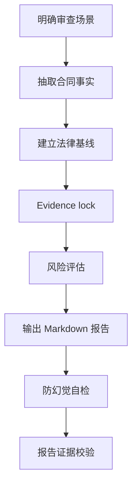

<p align="left">
  <a href="./README.md">English</a>
  |
  <a href="./README.zh.md">中文</a>
</p>

# 全球劳动合同雇主方审核 Skill

用于审核海外劳动合同和 Offer Letter 的雇主方 HR 合规审查 Skill。

这个 Skill 将全球劳动合同审核沉淀为一套可复用工作流：抽取合同事实、建立国家/地区法律基线、识别雇主方风险、标注依据来源，并生成可审计的 Markdown 审核报告。

## 更新重点

- 将合同审核从六项强制审核判断升级为七项强制审核判断，新增“当地特殊法定机制及中外差异”维度，识别会影响人力预算、Payroll 配置、HR 流程或用工安排的当地强制规则。
- 新增当地规则与中国全国性规则的双边官方取证要求，以及固定摘要行和紧凑提示表；合同已经覆盖的当地机制仍需提示，但不得制造虚假风险。
- 扩展报告验证脚本，检查当地差异摘要行、提示表、合同状态和证据标签。
- 新增政治、主权、国家/地区称谓专项审核。审核范围不局限于中国港澳台地区，也覆盖全球范围内公开常见的地区争议和敏感司法辖区表述，包括争议地区、政府名称、适用法律、司法管辖、公共机关、法律体系名称等。
- 新增 `⚑` 标识，用于提示政治/主权/地域称谓敏感问题。`⚑` 不是风险等级，应与 `🔴`、`🟠`、`🟡`、`🟢` 搭配使用，区分风险优先级。
- 将 `🟠` 章节从“高于法定权益 / 额外承诺条款”调整为“重要雇主风险 / 签前确认事项”，避免把政治敏感、治理审批、EOR/客户职责等问题误归类为员工权益或福利承诺问题。

## 版本重要更新记录

| 日期 | 更新内容 |
|---|---|
| 2026.07.24 | 新增第7项“当地特殊法定机制及中外差异”强制审核判断、固定提示表及证据验证硬门槛 |
| 2026.06.09 | 新增政治、主权、国家/地区称谓专项审核 |
| 2026.06.04 | 发布 |

## 本次更新说明（2026.07.24）

本次迭代源于墨西哥、埃及劳动合同审核中的实际问题：某些当地强制机制在中国全国性劳动规则中未见同类统一安排，却会直接增加用工成本或改变 HR、Payroll 的操作方式。Skill 不再只判断合同条款是否违法或对雇主不利，还会主动识别这类差异并转化为预算和执行动作。

主要变化：

1. **审核项由六项扩展为七项**
   本次新增第7项“当地特殊法定机制及中外差异”。Skill 固定审核以下7项：

   - `是否可以作为当地雇佣合同基础版本`；
   - `是否存在明显违法或低于法定底线的条款`；
   - `法定必备条款是否全面`；
   - `是否存在需签署前修改的雇主方风险`；
   - `是否存在高于法定权益 / 额外承诺`；
   - `是否存在 ⚑ 政治/主权/地域称谓敏感表述`；
   - `是否存在需 HR 特别关注的当地法定差异`。

   第7项识别范围包括法定调薪、发薪周期、法定奖金或津贴、特殊休假待遇、工时成本、社会保险和离职成本等。
2. **建立双边官方证据要求**
   当地规则必须引用当地官方来源，中国比较必须引用中国全国性官方规则。无法证明“中国没有”时，使用“在已核验的中国全国性规则中未见同类统一强制机制”等限定表达；任一侧证据不足时，合同状态必须标记为 `待确认`。

3. **固定增加当地差异摘要和提示表**
   每份报告的总体结论必须包含 `是否存在需 HR 特别关注的当地法定差异`，并使用以下固定字段：

   ```text
   事项 | 当地规则及中国差异 | 合同状态 | 雇主影响 | HR 动作 | 依据
   ```

   合同状态仅使用：`与法律冲突`、`缺少法定必备内容`、`法律直接适用但合同未明确`、`合同已覆盖`、`待确认`。

4. **不新增风险等级，不制造虚假风险**
   当合同与当地强制规则冲突时，仍按现有 `🔴`、`🟠`、`🟡`、`🟢` 体系分类；合同已覆盖的 Aguinaldo、Prima Vacacional 等机制仅进入当地差异提示表，说明预算和 Payroll 影响，不重复列为合同风险。

5. **强化成本和操作输出**
   每项差异必须说明对预算、Payroll、HR 流程或用工安排的具体影响。无法基于已核验规则和合同事实精确计算时，只提供成本项目、计算公式和责任方，不编造金额。

6. **增加结构验证硬门槛**
   `scripts/validate_report_evidence.py` 会检查固定摘要行、当地差异提示表、合同状态及证据标签。墨西哥测试明确“工资支付间隔不得超过15日”不等同于强制每14日的 biweekly 周期；墨西哥、埃及场景用于行为复测，但本次没有把两国规则硬编码为国家规则卡。

## 为什么要做这个 Skill

随着中资企业出海进程加快，企业业务覆盖的国家和地区越来越多，海外用工场景也变得更加复杂。不同国家和地区在劳动法规、移民法规、薪酬支付、社会保险、个人所得税、解除保护、竞业限制和雇主义务等方面存在明显差异，而合规用工是企业海外业务稳健运营的基础。

在这些合规事项中，劳动合同审核是正式合规用工的起点。合同不仅决定员工的基本雇佣条件，也会影响后续薪酬支付、假期管理、绩效管理、员工关系处理、解除安排、争议应对和证据留存。因此，随着海外用工规模扩大，不同国家和地区劳动合同的审核需求也在持续增加。

现实中，没有任何一个 HR 或律师能够完整掌握所有国家和地区的劳动法规、移民规则和用工实践。但劳动合同审核和员工关系管理具有共性：都需要识别用工主体、工作地点、适用法、薪酬福利、工时假期、解除安排、员工权益、雇主保护、证据留存和待确认事项。

这个 Skill 以海外人力专家审核全球多个国家和地区劳动合同的实践经验为基础，借助 AI 将可复用的审查逻辑、风险分类、来源核验和报告结构沉淀为标准化工作流。同时，通过官方来源优先、Evidence lock、固定降级提示、签署前待确认事项和报告证据校验脚本等机制，降低 AI 幻觉风险，提升输出质量和可审计性。

## 它审核什么

这个 Skill 审核可能让公司承担雇主义务的海外雇佣相关文件，范围限定为：

- 海外劳动合同；
- 包含雇佣条款的 Offer Letter；
- 固定期限或无固定期限劳动合同；
- 作为劳动合同或 Offer Letter 附件、且直接影响薪酬、假期、解除、奖金、佣金、保密、知识产权、竞业限制或公司政策的补充文件。

针对每份文件，Skill 固定完成7项强制审核判断：

1. 是否可以作为当地雇佣合同基础版本；
2. 是否存在明显违法或低于法定底线的条款；
3. 法定必备条款是否全面；
4. 是否存在需签署前修改的雇主方风险；
5. 是否存在高于法定权益 / 额外承诺；
6. 是否存在 ⚑ 政治/主权/地域称谓敏感表述；
7. 是否存在需 HR 特别关注的当地法定差异。
## 审查立场

这个 Skill 固定采用 **雇主方 HR 合规审查视角**，将公司视为审查客户。

它不是单纯判断员工权益是否充分，而是进一步判断：雇主能否签署、执行、举证、调整和解除，且不额外制造不必要的风险。

审查立场包括：

- 合规优先；
- 成本可控；
- 操作可执行；
- 证据可留痕；
- 法律判断保持审慎；
- 不替代最终法律意见。

它不提供最终法律意见。高风险或不确定事项会被转化为 HR 可执行建议和签署前待确认事项。

## 工作流



1. **明确审查场景**
   识别国家/地区、员工类型、雇佣模式、法律雇主、工作地点、适用法、发薪地、签证/工作授权和文件类型。

2. **抽取合同事实**
   先抽取条款，再做判断。审核 PDF、DOCX、TXT 或 Markdown 文件时，可使用 `scripts/extract_contract_text.py`。

3. **建立法律基线**
   官方来源优先。不编造法律、法定门槛、官方名称、薪酬基准或福利规则。

4. **Evidence lock**
   将每个拟写发现绑定到：
   - 合同证据：页面、章节、短原文摘录；
   - 规则/来源证据：官方来源编号、合同文本、内部文件或固定降级提示。

5. **风险评估**
   完成7项强制审核判断，其中第7项专门识别当地特殊法定机制及中外差异。实质合同问题仍归入四类处理动作之一；已经合规的当地机制只进入固定提示表。

6. **输出报告**
   使用报告模板和固定条款审核字段。

7. **自检和校验**  
   本地生成 Markdown 报告时，运行证据校验脚本。

## 风险等级

| 等级 | 名称 | 处理动作 |
|---|---|---|
| 🔴 | 重大合规风险 | 必须修改 |
| 🟠 | 重要雇主风险 | 建议确认或调整 |
| 🟡 | 一般条款风险 | 建议完善 |
| 🟢 | 文件完善事项 / 雇主保护补充 | 建议补充 |

这个区分很重要。某些条款不一定违法，但可能对雇主的成本、解除、证据或管理灵活性不利。这类问题不应一律归为“必须修改”，而应进入“建议确认或调整”。

第7项“当地特殊法定机制及中外差异”是强制审核判断，但不是新的风险等级。合同已覆盖当地法定机制时，应提示预算和操作影响，但不得仅因其与中国不同就赋予风险颜色。

## 报告结构

生成的 Markdown 报告采用以下结构：

```text
一、总体结论
二、合同基础信息与审查假设
三、风险总览
四、🔴 必须修改：明显违法或法定必备缺失条款
五、🟠 建议确认或调整：重要雇主风险 / 签前确认事项
六、🟡 建议完善：无明显违法但边界不清条款
七、🟢 建议补充：雇主保护条款
八、最终处理清单
九、签署前待确认事项
十、来源清单
附录：可以保留 / 暂不修改条款
```

其中“总体结论”固定包含 `是否存在需 HR 特别关注的当地法定差异`，并紧接 `### 当地特殊法定机制及中外差异提示` 表。若提示表事项同时构成合同风险，应引用对应编号发现，不重复完整分析。

四至七部分中的每个审核发现都使用同样六个字段：

```markdown
**条款位置：**
**原文内容：**
**问题判断：**
**雇主影响：**
**修改建议：**
**依据：**
```

这样 HR、Legal、Payroll、EOR 和业务负责人可以快速定位原文、理解影响、分配动作并留存依据。

## 来源纪律

每个风险发现都必须有来源支撑。

来源优先级：

1. 官方法律、劳动法典、雇佣法、官方公报、合并法规或政府法律数据库。
2. 劳工部、移民局、税务机关、社保机关、监管机构、法院或劳动仲裁机构官方指南。
3. 政府 FAQ、雇主指南、工资令、假期权益页面、签证/工签页面。
4. EOR、供应商或当地律师资料，仅作为辅助支持。
5. 律所或会计师事务所更新，仅在官方来源缺失或过于笼统时使用。
6. 模型知识库只能作为最后兜底。

如果没有检索到官方来源，报告必须包含：

```text
⚠️ 未检索到官方来源，以下基于模型知识库，需人工核实。
```

## 防幻觉机制

这个 Skill 包含明确的防幻觉控制：

- 不编造法律名称、条文编号、法定天数、比例、金额、签证规则或官方机构名称；
- 合同事实必须来自合同、附件、offer letter、员工基础信息或用户提供的上下文；
- 每个发现必须绑定合同证据和来源证据；
- 引用来源必须支撑具体判断，而不是只和话题相关；
- 不确定事项进入 `签署前待确认事项`；
- 最终报告可使用 `scripts/validate_report_evidence.py` 校验。

校验脚本会检查必备字段、来源编号、占位符、过度确定表述和必备章节。

对于当地差异维度，校验脚本还会检查固定摘要行、提示表、允许的合同状态及 `[S#]` 证据标签；已经确认的中外差异必须同时具有当地和中国规则依据。

## 安装

### 前置条件

- 已安装 Claude Code、Codex，或其他兼容 Agent Skills 的 AI 助手。
- 如采用 clone 方式安装，需要已安装 Git。
- 支持系统：Windows、macOS、Linux。

### 方式一：Clone 到 skills 目录

Claude Code：

```bash
# Linux / macOS
git clone https://github.com/AlexDou-Y/global-employment-contract-review.git \
  ~/.claude/skills/global-employment-contract-review
```

```powershell
# Windows PowerShell
git clone https://github.com/AlexDou-Y/global-employment-contract-review.git `
  "$HOME\.claude\skills\global-employment-contract-review"
```

Codex：

```bash
# Linux / macOS
git clone https://github.com/AlexDou-Y/global-employment-contract-review.git \
  ~/.codex/skills/global-employment-contract-review
```

```powershell
# Windows PowerShell
git clone https://github.com/AlexDou-Y/global-employment-contract-review.git `
  "$HOME\.codex\skills\global-employment-contract-review"
```

### 方式二：手动下载

1. 下载本仓库 ZIP 文件。
2. 解压 ZIP 文件。
3. 将整个 `global-employment-contract-review/` 目录复制到对应 skills 目录：

| AI 助手 | Linux / macOS | Windows |
|---|---|---|
| Claude Code | `~/.claude/skills/` | `%USERPROFILE%\.claude\skills\` |
| Codex | `~/.codex/skills/` | `%USERPROFILE%\.codex\skills\` |

### 验证安装

重启或刷新 AI 助手后，检查 skills 列表：

- Claude Code：输入 `/skills`，确认可以看到 `global-employment-contract-review`。
- Codex：开启新会话，确认 skills 列表中可以看到该 Skill。

## 使用方式

上传或提供劳动合同文件，并在提示词中明确调用该 Skill：

```text
使用 global-employment-contract-review，按雇主方 HR 合规审查视角，审核这个澳洲劳动合同。请输出 Markdown 报告，所有风险提示需要标注来源；如无法找到官方来源，请使用降级提示并列入签署前待确认事项。
```

为提高审核质量，建议同时提供：

- 国家 / 地区；
- 员工类型和实际工作地点；
- 法定雇主和发薪主体；
- 合同文件或已抽取的合同文本；
- 已知的 Modern Award、集体协议、EOR、Payroll、Tax、签证或当地律师背景信息。

## 工具

### 抽取合同文本

```powershell
python scripts\extract_contract_text.py "path\to\contract.pdf" -o "path\to\contract.txt"
```

支持输入格式：

- `.pdf`
- `.docx`
- `.txt`
- `.md`

### 校验报告证据

```powershell
python scripts\validate_report_evidence.py "path\to\review-report.md"
```

校验脚本会检查：

- 每个审核发现是否包含必备字段；
- 是否缺少来源编号；
- 已使用的来源编号是否未列入来源清单；
- 是否存在未清理的占位符；
- 是否存在 `完全合规`、`无风险`、`一定合法`、`保证合规` 等过度确定表述；
- 是否包含 `签署前待确认事项` 和 `来源清单` 等必备章节。

## 目录结构

```text
global-employment-contract-review/
├─ SKILL.md
├─ README.md
├─ README.zh.md
├─ agents/
│  └─ openai.yaml
├─ docs/
│  ├─ introducing-global-employment-contract-review-skill.en.md
│  ├─ introducing-global-employment-contract-review-skill.zh.md
│  └─ introducing-global-employment-contract-review-skill.zh-en.md
├─ references/
│  ├─ anti-hallucination-rules.md
│  ├─ country-rule-template.md
│  ├─ output-requirements.md
│  ├─ review-framework.md
│  ├─ risk-taxonomy.md
│  └─ source-verification-rules.md
├─ scripts/
│  ├─ extract_contract_text.py
│  └─ validate_report_evidence.py
├─ tests/
│  ├─ test_local_difference_source_validation.py
│  ├─ test_readme_local_difference_update.py
│  ├─ test_seven_review_judgments.py
│  └─ test_validate_report_evidence.py
└─ templates/
   ├─ contract-review-report.md
   ├─ country-rule-card.md
   └─ issue-list-table.md
```

## 示例 Prompt

```text
使用 global-employment-contract-review，按雇主方 HR 合规审查视角，审核这个澳洲劳动合同。请输出 Markdown 报告，所有风险提示需要标注来源；如无法找到官方来源，请使用降级提示并列入签署前待确认事项。
```

## 校验

修改 Skill 后建议运行：

```powershell
$env:PYTHONUTF8='1'
python "<path-to-skill-creator>\scripts\quick_validate.py" "."
python ".\scripts\validate_report_evidence.py" "path\to\review-report.md"
```

预期输出：

```text
Skill is valid!
Evidence validation passed.
```

## 使用边界

- 这个 Skill 用于 HR 合规审查和合同风险初筛，不替代最终法律意见。
- 不同国家和议题的官方来源可获得性不同。
- 解除、竞业限制、税务、社保、移民、EOR 责任等事项通常需要当地律师、供应商、Payroll、Tax/Finance 或 Legal 确认。
- 如果事实信息缺失，报告应列明假设并放入签署前待确认事项。

## 致谢

本 Skill 基于 Alex Dou 在中外企业从事 HR 管理，以及实际审核、处理中国、日本、韩国、东南亚、中东、欧洲等多个国家和地区劳动合同与员工关系事项的实践经验持续优化。感谢这些跨区域用工场景中的真实问题、复盘和方法沉淀，为本 Skill 的审查框架、风险分类、来源核验和输出结构提供了持续迭代的基础。
