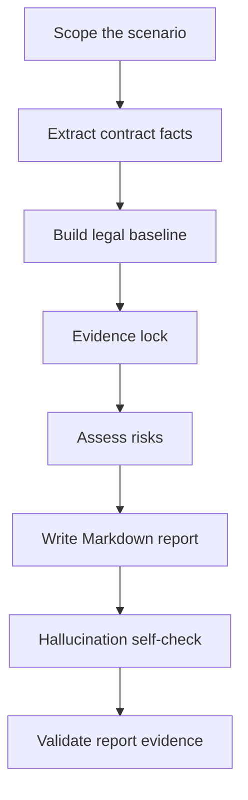

# Introducing Global Employment Contract Review

<p align="center">
  <a href="./introducing-global-employment-contract-review-skill.en.md">English</a>
  |
  <a href="./introducing-global-employment-contract-review-skill.zh.md">中文</a>
</p>

> A Codex Skill for employer-side HR compliance review of overseas employment contracts and Offer Letters.

## 1. Why This Skill Was Built

As more Chinese companies expand globally, their business operations increasingly span multiple countries and regions, making overseas employment more complex. Labor laws, immigration rules, payroll practices, social security, individual income tax, termination protections, restrictive covenants, and employer obligations can vary significantly by jurisdiction. Compliant employment is a foundation for stable overseas operations.

Employment contract review is the starting point of compliant employment. A contract does not only define the employee's basic terms and conditions; it also affects payroll execution, leave management, performance management, employee relations, termination handling, dispute response, and evidence retention. As overseas hiring grows, the demand for contract review across different jurisdictions continues to increase.

In practice, no single HR professional or lawyer can fully master the labor laws, immigration rules, and employment practices of every country and region. At the same time, employment contract review and employee relations management have shared patterns. They both require the reviewer to identify the legal employer, work location, governing law, compensation and benefits, working time and leave, termination arrangements, employee entitlements, employer protections, evidence retention, and issues requiring professional confirmation.

This Skill was built from an overseas HR practitioner's practical experience reviewing employment contracts across multiple countries and regions. With AI, that experience is distilled into a reusable workflow covering review logic, risk classification, source verification, report structure, and action tracking. To reduce AI hallucination and improve auditability, the Skill uses official-source priority, Evidence lock, mandatory fallback wording, signing-before-confirmation items, and a report evidence validation script.

## 2. What It Reviews

The Skill reviews overseas employment-related documents that may create employment obligations for the company. The document scope is limited to:

- overseas employment contracts;
- Offer Letters containing employment terms;
- fixed-term and indefinite employment contracts;
- annexes or side documents attached to an employment contract or Offer Letter that directly affect compensation, leave, termination, bonus, commission, confidentiality, IP, restrictive covenants, or workplace policies.

For each document, the Skill checks:

- whether any clause appears to conflict with mandatory local employment rules;
- whether statutory mandatory contract content is missing or needs confirmation;
- whether the contract grants employee rights or company commitments above statutory minimums;
- whether the wording creates employer-unfavorable cost, management, evidence, enforceability, or termination risk;
- which issues require Legal, local counsel, Payroll, EOR, Tax/Finance, visa vendor, or business owner confirmation before signing.

## 3. Review Perspective

The Skill uses an **employer-side HR compliance perspective**.

It does not simply ask whether the employee receives enough protection. It asks whether the employer can sign, operate, prove, modify, and terminate under the contract without creating unnecessary risk.

The review position is:

- compliance first;
- cost controlled;
- operationally executable;
- evidence-ready;
- legally cautious;
- no final legal sign-off.

## 4. How The Workflow Works



The workflow has seven steps:

1. Scope the country, employee type, employment model, legal employer, work location, governing law, payroll location, and visa/work authorization.
2. Extract contract facts before making legal judgments.
3. Build a country-specific legal baseline using official sources first.
4. Lock evidence by connecting each finding to contract text and source support.
5. Assess risks using four mandatory questions.
6. Generate a Markdown report.
7. Run hallucination and evidence checks before delivery.

## 5. Risk Classification

| Level | Meaning | Action |
|---|---|---|
| 🔴 | Major compliance risk | Must revise |
| 🟠 | Important employer risk | Confirm or adjust |
| 🟡 | General clause risk | Improve wording or boundaries |
| 🟢 | File improvement / employer protection | Add protection or complete records |

This distinction matters. A clause can be lawful but still commercially or operationally unfavorable to the employer. Such issues should not always be labelled as "must revise"; they may need confirmation, narrowing, or business approval.

## 6. Report Structure

The Skill generates a Markdown report with this structure:

```text
1. Overall conclusion
2. Contract basic information and review assumptions
3. Risk overview
4. 🔴 Must revise: clear illegality or missing mandatory content
5. 🟠 Confirm or adjust: above-statutory entitlements / extra commitments
6. 🟡 Improve: no obvious illegality but unclear boundaries
7. 🟢 Add: employer-protection clauses
8. Final action checklist
9. Signing-before-confirmation items
10. Source list
Appendix: clauses that can be retained / no immediate change
```

Each finding uses the same six fields:

```text
Clause location
Original wording
Issue judgment
Employer impact
Modification recommendation
Basis / source
```

## 7. Source Discipline

Every risk finding must have source support. Official sources are preferred:

1. legislation, labor code, employment act, gazette, consolidated statute, or official legal database;
2. labor ministry, immigration authority, tax authority, social security authority, regulator, court, or labor tribunal guidance;
3. official government FAQ, employer guide, wage order, leave entitlement page, or visa/work permit page;
4. EOR, vendor, or local counsel material as secondary support;
5. law firm or accounting firm updates only when official sources are unavailable or too general;
6. model knowledge only as fallback.

If no official source is found, the report must say:

```text
⚠️ 未检索到官方来源，以下基于模型知识库，需人工核实。
```

## 8. Anti-Hallucination Design

This Skill includes explicit anti-hallucination controls:

- no invented laws, article numbers, statutory rates, statutory days, official names, visa rules, or contract facts;
- every finding must bind contract evidence and rule/source evidence;
- cited sources must support the exact judgment, not just the general topic;
- uncertain issues must be moved to the signing-before-confirmation section;
- local reports can be checked by `scripts/validate_report_evidence.py`.

The validator checks required fields, source labels, unresolved placeholders, over-certain wording, and required sections.

## 9. Repository Structure

```text
global-employment-contract-review/
├─ SKILL.md
├─ README.md
├─ agents/
├─ docs/
├─ references/
├─ scripts/
└─ templates/
```

## 10. Example Prompt

```text
Use global-employment-contract-review to review this Australia employment agreement from the employer-side HR compliance perspective. Output a Markdown report. Cite sources for every risk finding. If no official source is found, use the fallback warning and list the issue under signing-before-confirmation items.
```

## 11. Validation

```powershell
$env:PYTHONUTF8='1'
python "<path-to-skill-creator>\scripts\quick_validate.py" "."
python ".\scripts\validate_report_evidence.py" "path\to\review-report.md"
```

Expected outputs:

```text
Skill is valid!
Evidence validation passed.
```

## 12. Limitations

This Skill is designed for HR compliance review and risk triage. It does not replace final legal advice. For termination, restrictive covenant, tax, social security, immigration, EOR responsibility, or high-risk local law issues, HR should confirm with Legal, local counsel, Payroll, Tax/Finance, EOR provider, visa vendor, or business owner as appropriate.
