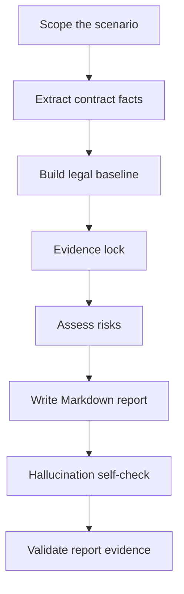

# Introducing Review Overseas Employment Contracts

# 海外劳动合同雇主方审核 Skill 介绍

> **English:** A Codex Skill for employer-side HR compliance review of overseas employment contracts.  
> **中文：** 一个用于海外劳动合同雇主方 HR 合规审查的 Codex Skill。

---

## 1. Why This Skill Was Built

As more Chinese companies expand globally, their business operations increasingly span multiple countries and regions, making overseas employment more complex. Labor laws, immigration rules, payroll practices, social security, individual income tax, termination protections, restrictive covenants, and employer obligations can vary significantly by jurisdiction. Compliant employment is a foundation for stable overseas operations.

Employment contract review is the starting point of compliant employment. A contract does not only define the employee's basic terms and conditions; it also affects payroll execution, leave management, performance management, employee relations, termination handling, dispute response, and evidence retention. As overseas hiring grows, the demand for contract review across different jurisdictions continues to increase.

In practice, no single HR professional or lawyer can fully master the labor laws, immigration rules, and employment practices of every country and region. At the same time, employment contract review and employee relations management have shared patterns. They both require the reviewer to identify the legal employer, work location, governing law, compensation and benefits, working time and leave, termination arrangements, employee entitlements, employer protections, evidence retention, and issues requiring professional confirmation.

This Skill was built from the practical experience of overseas HR expert AlexD in multinational HR management and multi-jurisdiction employment contract review. With AI, that experience is distilled into a reusable workflow covering review logic, risk classification, source verification, report structure, and action tracking. To reduce AI hallucination and improve auditability, the Skill uses official-source priority, Evidence lock, mandatory fallback wording, signing-before-confirmation items, and a report evidence validation script.

## 1. 为什么要做这个 Skill

随着中资企业出海进程加快，企业业务覆盖的国家和地区越来越多，海外用工场景也变得更加复杂。不同国家和地区在劳动法规、移民法规、薪酬支付、社会保险、个人所得税、解除保护、竞业限制和雇主义务等方面存在明显差异，而合规用工是企业海外业务稳健运营的基础。

在这些合规事项中，劳动合同审核是正式合规用工的起点。合同不仅决定员工的基本雇佣条件，也会影响后续薪酬支付、假期管理、绩效管理、员工关系处理、解除安排、争议应对和证据留存。因此，随着海外用工规模扩大，不同国家和地区劳动合同的审核需求也在持续增加。

现实中，没有任何一个 HR 或律师能够完整掌握所有国家和地区的劳动法规、移民规则和用工实践。但劳动合同审核和员工关系管理具有共性：都需要识别用工主体、工作地点、适用法、薪酬福利、工时假期、解除安排、员工权益、雇主保护、证据留存和待确认事项。

这个 Skill 基于海外 HR 专家 AlexD 在跨国公司人力资源管理和多国劳动合同审核中的实践经验，借助 AI 将可复用的审查逻辑、风险分类、来源核验和报告结构沉淀为标准化工作流。同时，通过官方来源优先、Evidence lock、固定降级提示、签署前待确认事项和报告证据校验脚本等机制，降低 AI 幻觉风险，提升输出质量和可审计性。

---

## 2. What It Reviews

The Skill reviews overseas employment-related documents that may create employment obligations for the company, including:

- local employment agreements;
- offer letters containing employment terms;
- EOR employment templates;
- expatriate employment documents;
- fixed-term and indefinite employment contracts;
- country-specific labor contract templates;
- annexes or side documents that affect compensation, leave, termination, bonus, commission, confidentiality, IP, restrictive covenants, or workplace policies.

For each document, the Skill checks:

- whether any clause appears to conflict with mandatory local employment rules;
- whether statutory mandatory contract content is missing or needs confirmation;
- whether the contract grants employee rights or company commitments above statutory minimums;
- whether the wording creates employer-unfavorable cost, management, evidence, enforceability, or termination risk;
- which issues require Legal, local counsel, Payroll, EOR, Tax/Finance, visa vendor, or business owner confirmation before signing.

## 2. 它审核什么

这个 Skill 审核可能让公司承担雇主义务的海外雇佣相关文件，包括：

- 本地劳动合同；
- 包含雇佣条款的 offer letter；
- EOR 雇佣模板；
- 外派雇佣文件；
- 固定期限或无固定期限劳动合同；
- 国家/地区劳动合同模板；
- 影响薪酬、假期、解除、奖金、佣金、保密、知识产权、竞业限制或公司政策的附件和补充文件。

针对每份文件，它重点判断：

- 是否存在与当地强制性劳动规则冲突的条款；
- 是否缺少法定必备劳动合同内容，或是否需要进一步确认；
- 是否授予员工高于法定最低标准的权益，或形成公司额外承诺；
- 是否存在对雇主不利的成本、管理、证据、可执行性或解除风险；
- 哪些事项需要在签署前由 Legal、当地律师、Payroll、EOR、Tax/Finance、签证供应商或业务负责人确认。

---

## 3. Review Perspective

The Skill uses an **employer-side HR compliance perspective**.

It does not simply ask whether the employee receives enough protection. It asks whether the employer can sign, operate, prove, modify, and terminate under the contract without creating unnecessary risk.

The review position is:

- compliance first;
- cost controlled;
- operationally executable;
- evidence-ready;
- legally cautious;
- no final legal sign-off.

## 3. 审查视角

这个 Skill 固定采用 **雇主方 HR 合规审查视角**。

它不是单纯判断员工权益是否充分，而是进一步判断：雇主能否签署、执行、举证、调整和解除，且不额外制造不必要的风险。

审查立场包括：

- 合规优先；
- 成本可控；
- 操作可执行；
- 证据可留痕；
- 法律判断保持审慎；
- 不替代最终法律意见。

---

## 4. How The Workflow Works



The workflow has seven steps:

1. Scope the country, employee type, employment model, legal employer, work location, governing law, payroll location, and visa/work authorization.
2. Extract contract facts before making legal judgments.
3. Build a country-specific legal baseline using official sources first.
4. Lock evidence by connecting each finding to contract text and source support.
5. Assess risks using four mandatory questions.
6. Generate a Markdown report.
7. Run hallucination and evidence checks before delivery.

## 4. 工作流如何运行

工作流分为七步：

1. 明确国家/地区、员工类型、雇佣模式、法律雇主、工作地点、适用法、发薪地和工签/工作权。
2. 先抽取合同事实，再做法律和风险判断。
3. 建立国家/地区法律基线，官方来源优先。
4. 进行 Evidence lock，将每个发现绑定合同原文和来源依据。
5. 使用四个强制问题进行风险评估。
6. 输出 Markdown 审核报告。
7. 交付前运行防幻觉和证据校验。

---

## 5. Risk Classification

The Skill uses four risk levels:

| Level | Meaning | Action |
|---|---|---|
| 🔴 | Major compliance risk | 必须修改 |
| 🟠 | Important employer risk | 建议确认或调整 |
| 🟡 | General clause risk | 建议完善 |
| 🟢 | File improvement / employer protection | 建议补充 |

This distinction is important. A clause can be lawful but still commercially or operationally unfavorable to the employer. Such issues should not always be labelled as "must revise"; they may need confirmation, narrowing, or business approval.

## 5. 风险分级

这个 Skill 使用四类风险等级：

| 等级 | 含义 | 处理动作 |
|---|---|---|
| 🔴 | 重大合规风险 | 必须修改 |
| 🟠 | 重要雇主风险 | 建议确认或调整 |
| 🟡 | 一般条款风险 | 建议完善 |
| 🟢 | 文件完善事项 / 雇主保护补充 | 建议补充 |

这个区分很重要。某些条款不一定违法，但可能对雇主的成本、解除、证据或管理灵活性不利。这类问题不应一律归为“必须修改”，而应进入“建议确认或调整”。

---

## 6. Report Structure

The Skill generates a Markdown report with the following structure:

```text
一、总体结论
二、合同基础信息与审查假设
三、风险总览
四、🔴 必须修改：明显违法或法定必备缺失条款
五、🟠 建议确认或调整：高于法定权益 / 额外承诺条款
六、🟡 建议完善：无明显违法但边界不清条款
七、🟢 建议补充：雇主保护条款
八、最终处理清单
九、签署前待确认事项
十、来源清单
附录：可以保留 / 暂不修改条款
```

Each finding uses the same six fields:

```text
条款位置
原文内容
问题判断
雇主影响
修改建议
依据
```

## 6. 报告结构

这个 Skill 输出固定结构的 Markdown 报告：

```text
一、总体结论
二、合同基础信息与审查假设
三、风险总览
四、🔴 必须修改：明显违法或法定必备缺失条款
五、🟠 建议确认或调整：高于法定权益 / 额外承诺条款
六、🟡 建议完善：无明显违法但边界不清条款
七、🟢 建议补充：雇主保护条款
八、最终处理清单
九、签署前待确认事项
十、来源清单
附录：可以保留 / 暂不修改条款
```

每个审核发现统一使用六个字段：

```text
条款位置
原文内容
问题判断
雇主影响
修改建议
依据
```

这样 HR、Legal、Payroll、EOR 和业务负责人可以快速定位原文、理解影响、分配动作并留存依据。

---

## 7. Source Discipline

The Skill requires source support for every risk finding. Official sources are preferred:

1. legislation, labor code, employment act, gazette, consolidated statute, or official legal database;
2. labor ministry, immigration authority, tax authority, social security authority, regulator, court, or labor tribunal guidance;
3. official government FAQ, employer guide, wage order, leave entitlement page, or visa/work permit page;
4. EOR, vendor, or local counsel material as secondary support;
5. law firm or accounting firm updates only when official sources are unavailable or too general;
6. model knowledge only as fallback.

If no official source is found, the report must say:

```text
⚠️ 未检索到官方来源，以下基于模型知识库，需人工核实。
```

## 7. 来源纪律

这个 Skill 要求每个风险发现都有依据支撑，并优先使用官方来源：

1. 法律、劳动法典、雇佣法、官方公报、合并法规或官方法律数据库；
2. 劳工部、移民局、税务机关、社保机关、监管机构、法院或劳动仲裁机构指南；
3. 政府 FAQ、雇主指南、工资令、假期权益页面、签证/工签页面；
4. EOR、供应商或当地律师资料，仅作为辅助支持；
5. 律所或会计师事务所文章，仅在官方来源缺失或过于笼统时使用；
6. 模型知识库只能作为最后兜底。

如果无法检索到官方来源，报告必须写明：

```text
⚠️ 未检索到官方来源，以下基于模型知识库，需人工核实。
```

---

## 8. Anti-Hallucination Design

This Skill includes explicit anti-hallucination controls:

- no invented laws, article numbers, statutory rates, statutory days, official names, visa rules, or contract facts;
- every finding must bind contract evidence and rule/source evidence;
- cited sources must support the exact judgment, not just the general topic;
- uncertain issues must be moved to the signing-before-confirmation section;
- local reports can be checked by `scripts/validate_report_evidence.py`.

The validator checks required fields, source labels, unresolved placeholders, over-certain wording, and required sections.

## 8. 防幻觉设计

这个 Skill 增加了明确的防幻觉机制：

- 不编造法律名称、条文编号、法定比例、法定天数、官方名称、签证规则或合同事实；
- 每个发现必须绑定合同证据和规则/来源证据；
- 引用来源必须支撑具体判断，而不是只和话题相关；
- 不确定事项必须进入签署前待确认事项；
- 本地生成的报告可以使用 `scripts/validate_report_evidence.py` 校验。

校验脚本会检查必备字段、来源编号、占位符、过度确定表述和必备章节。

---

## 9. Repository Structure

```text
review-overseas-employment-contracts/
├─ SKILL.md
├─ README.md
├─ agents/
│  └─ openai.yaml
├─ docs/
│  └─ introducing-review-overseas-employment-contracts-skill.zh-en.md
├─ references/
│  ├─ anti-hallucination-rules.md
│  ├─ country-rule-template.md
│  ├─ output-requirements.md
│  ├─ review-framework.md
│  ├─ risk-taxonomy.md
│  └─ source-verification-rules.md
├─ scripts/
│  ├─ extract_contract_text.py
│  └─ validate_report_evidence.py
└─ templates/
   ├─ contract-review-report.md
   ├─ country-rule-card.md
   └─ issue-list-table.md
```

## 9. 仓库结构

这个 Skill 采用主入口、规则、工具、模板分层结构：

- `SKILL.md`：Skill 主入口和工作流；
- `references/`：审核框架、来源规则、风险分级、防幻觉规则；
- `scripts/`：文本抽取和证据校验工具；
- `templates/`：审核报告、条款发现、国家规则卡模板；
- `docs/`：面向 GitHub 或知识库发布的介绍文章。

---

## 10. Example Prompt

```text
Use review-overseas-employment-contracts to review this Australia employment agreement from the employer-side HR compliance perspective. Output a Markdown report. Cite sources for every risk finding. If no official source is found, use the fallback warning and list the issue under signing-before-confirmation items.
```

## 10. 示例 Prompt

```text
使用 review-overseas-employment-contracts，按雇主方 HR 合规审查视角，审核这个澳洲劳动合同。请输出 Markdown 报告，所有风险提示需要标注来源；如无法找到官方来源，请使用降级提示并列入签署前待确认事项。
```

---

## 11. Validation

Recommended validation commands:

```powershell
$env:PYTHONUTF8='1'
python "<path-to-skill-creator>\scripts\quick_validate.py" "."
python ".\scripts\validate_report_evidence.py" "path\to\review-report.md"
```

Expected outputs:

```text
Skill is valid!
Evidence validation passed.
```

## 11. 校验方式

建议使用两个校验：

- `quick_validate.py`：确认 Skill 结构有效；
- `validate_report_evidence.py`：确认报告字段、来源和防幻觉要求符合规则。

---

## 12. Limitations

This Skill is designed for HR compliance review and risk triage. It does not replace final legal advice. For termination, restrictive covenant, tax, social security, immigration, EOR responsibility, or high-risk local law issues, HR should confirm with Legal, local counsel, Payroll, Tax/Finance, EOR provider, visa vendor, or business owner as appropriate.

## 12. 使用边界

这个 Skill 用于 HR 合规审查和风险初筛，不替代最终法律意见。对于解除、竞业限制、税务、社保、工签、EOR 责任或高风险当地法律问题，HR 应根据事项类型进一步找 Legal、当地律师、Payroll、Tax/Finance、EOR、签证供应商或业务负责人确认。
